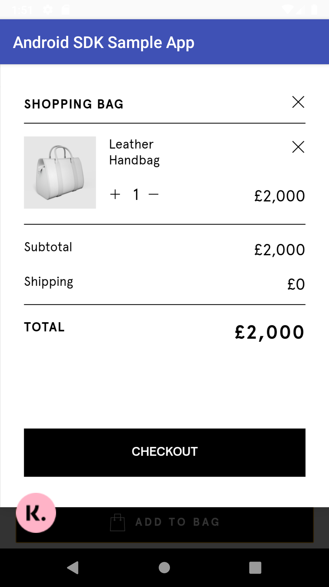
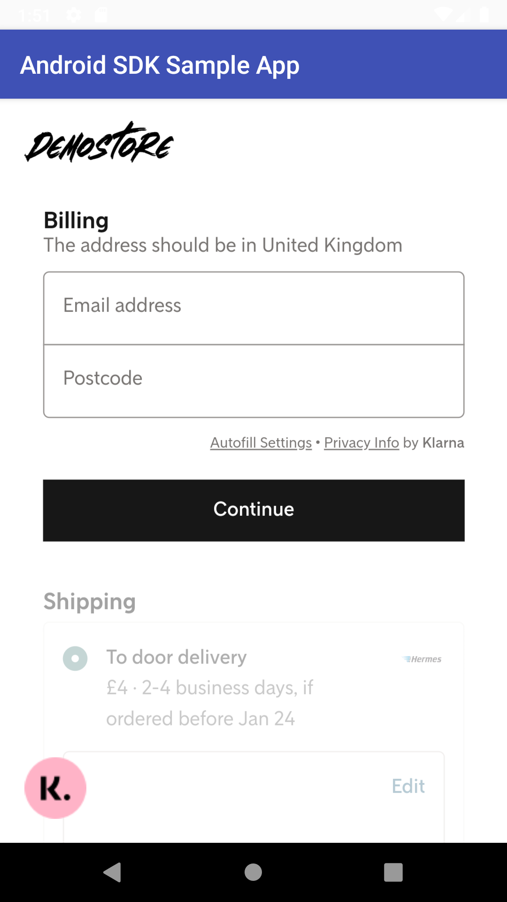
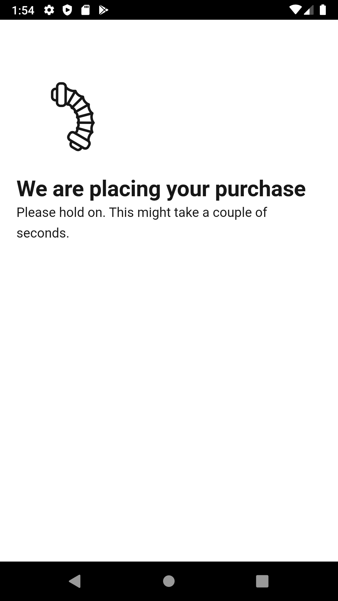
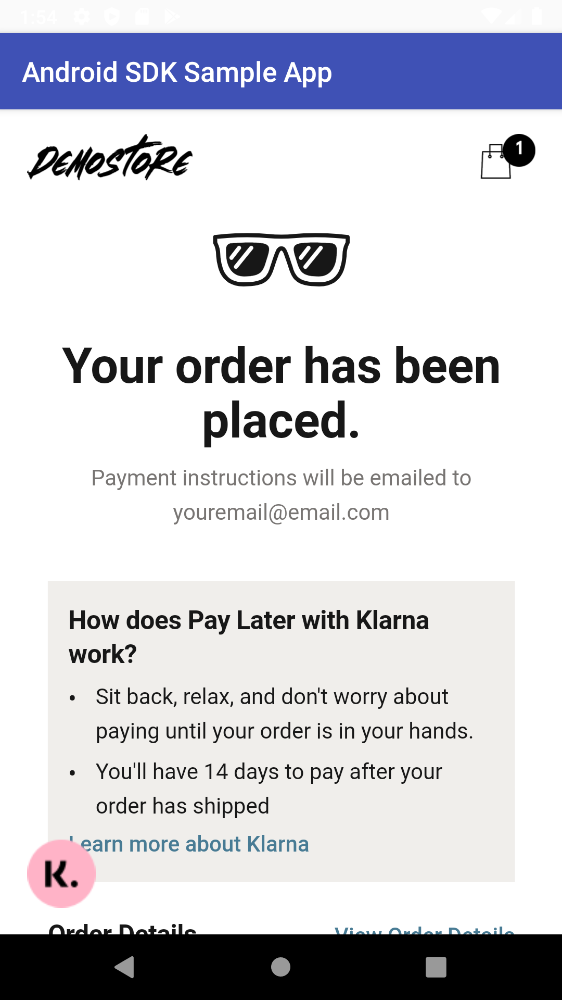

# Klarna Checkout SDK - Android Demo App

This is a demo app for Android to demonstrate Klarna Checkout SDK usage.

The Klarna Checkout SDK allows merchants to integrate Klarna Checkout in native or hybrid Android applications. It's aimed to make integration simple and provide the smoothest in-app purchase experience.

**Looking for the Klarna In-App SDK Android Demo app?** Check out the [Klarna Checkout Android Demo App](https://github.com/klarna/kp-android-example-app) repo instead.

## What does Klarna Checkout SDK offer?

Klarna Checkout SDK offers two integration approaches: **Native integration** and **Hybrid integration**.

In the Native approach, your mobile app presents the Klarna Checkout view using our mobile SDK. The mobile SDK requests the Klarna checkout HTML snippet from Klarna through your end point. Your back-end acts as a communicaiton tunnel.

In the Hybrid approach, your mobile app displays the Klarna checkout as a WebView. Your back-end acts as a web server, rendering the Klarna Checkout on a web apge that you host, presented in the WebView in your mobile app.

[Read more about the SDK itself.](https://developers.klarna.com/documentation/klarna-checkout/mobile-apps/)

## Setup

* Open the project and (**optionally**) customize the loaded url in `MainActivity` file to your liking. You can see all supported countries in the demo tool at [https://www.klarna.com/demo/](https://www.klarna.com/demo/). Please make sure that you load Klarna Checkout and note that not all countries support Klarna Checkout in the demo tool.
* Run the `app` configuration.

### Native Integration
The components in the Native approach are:

* An integration of Klarna Checkout from your servers to Klarna's servers.
* An end-point on your servers, where Klarna Checkout is fetched from the mobile SDK.
* Klarna Checkout SDK for mobile apps.
* Your mobile app.

Integrating Klarna Checkout consists of six steps:

1. Installation of Klarna Checkout.
2. Prepare your app by changing the configuration or app manifest.
3. Prepare back-end endpoint to fetch a Checkout snippet.
4. Initialize the SDK with the Checkout snippet.
5. Present the Klarna Checkout view.
6. Configure event listeners.

### Hybrid Integration
The components in the Hybrid approach are:

* An integration of Klarna Checkout from your servers to Klarna's servers.
* A web page on your servers, where Klarna Checkout is fetched from the mobile SDK.
* Klarna Checkout SDK for mobile apps.
* Your mobile app.

Integrating Klarna Checkout consists of six steps:

1. Installation of Klarna Checkout.
2. Prepare your app by changing the configuration or app manifest.
3. Prepare your web page with Klarna Checkout integrated.
4. Initialize the SDK with your WebView.
5. Present your web page.
6. Configure event listeners.

## Screenshots

   

## Requirements
* Android 4.4 or later.

## Support
If you are having any issues running the SDK in the demo app, please create a questions on [Stack Overflow](https://stackoverflow.com/questions/tagged/klarna-inapp-sdk) tagged with `klarna-inapp-sdk`. If you think that something is wrong with the demo app itself, please create an issue.

### Developer Documentation

* [Klarna Checkout Overview](https://developers.klarna.com/documentation/klarna-checkout/)
* [SDK Overview](https://developers.klarna.com/documentation/klarna-checkout/mobile-apps/)

### API Documentation
*  [iOS](https://cocoadocs.org/docsets/KlarnaCheckoutSDK/)
*  [Android](https://rawgit.com/klarna/kco-mobile-sdk/master/android/docs/index.html)

## Contributing
Thank you for reading this and taking time to contribute to Klarna Checkout SDK - Android Demo App! Below is a set of guidelines to help you contribute whether you want to report a bug, come with suggestions or modify code.

### How can I contribute?
#### Reporting Bugs
This section will guide you through submitting a bug report for Klarna Checkout SDK - Android Demo App.

Before submitting a bug report, please check that the issue hasn't been reported before. If you find a *Closed* issue that seem to describe an issue that is similar to what you want to report, open a new issue and link to the original issue in the new one. When you have checked that the issue hasn't been reported before **fill out [the required template](https://github.com/klarna/kco-android-example-app/blob/master/.github/ISSUE_TEMPLATE/bug_report.md)** which will help us resolve the issue faster. 

##### Submitting a Bug Report
Bugs that are submitted are tracked as [GitHub issues](https://guides.github.com/features/issues/). To report a bug, create an issue and use [the template](https://github.com/klarna/kco-android-example-app/blob/master/.github/ISSUE_TEMPLATE/bug_report.md) to provide information about the bug. Explain the problem thoroughly and include any additional information that you think might help the maintainers reproduce the issue. When creating the GitHub issue please make sure that you:

* **Use a clear and descriptive title** for the issue.
* **Describe the exact steps which reproduce the problem** with as many details as possible. It's generally better to provide too much than too little information.
* **Describe the behavior you observed after following the steps** and explain exactly what the problem is with that behavior.
* **Explain which behavior you expected instead** and why.
* **Provide screenshots and/or screen recordings** that might help explain the issue you are facing. To screen record a phone connected to Android Studio or an emulator follow the steps [here](https://developer.android.com/studio/debug/am-video). To screen record on iOS follow the steps described [here](https://support.apple.com/en-us/HT207935).
* **Include relevant logs in the bug report** by putting it in a [code block](https://help.github.com/en/github/writing-on-github/getting-started-with-writing-and-formatting-on-github#multiple-lines), a [file attachment](https://help.github.com/en/github/managing-your-work-on-github/file-attachments-on-issues-and-pull-requests) or in a [gist](https://help.github.com/en/github/writing-on-github/creating-gists) and provide a link to that gist.
* **Tell how recently you started having the issue.** When was the first time you experienced the issue and was it after updating the SDK version? Or has it always been a problem?
* If the problem started happening recently, **can you reproduce it in an older version of the SDK?** What's the most recent version in which the problem doesn't happen?
* **Can you reliably reproduce the issue?** If not, explain how often it occurs and under what conditions it normally happens. For example in what environment you are running.

Include details about the device/emulator/simulator you are experiencing the issue on:

* **Which version of the SDK are you using?**
* **Which OS is this a problem in, iOS, Android or both?** What version(s)? Also add the appropriate label to the issue.
* **Did you experience the issue in simulator/emulator or on real device(s)?**

#### Contributing with Code
Before contributing please read through the [Klarna Checkout SDK documentation](https://developers.klarna.com/documentation/klarna-checkout/mobile-apps/).

##### Branching
Prefix the branch you are going to work on depending on what you are working on (bug fix or feature). Use the following prefixes when creating a new branch:

* **feature/** if the branch contains a new feature, example: `feature/my-shiny-feature`.
* **bugfix/**  if the branch contains a bug fix, example: `bugfix/my-bug-fix`.

##### Pull Requests
When creating a PR include as much information as possible about the type of enhancement, whether if it's a bugfix, new functionality or any other change. There's [a template](https://github.com/klarna/kco-android-example-app/blob/master/.github/ISSUE_TEMPLATE/pull-request.md) for you to fill out which will make the review process for the maintainers faster. When creating a PR do it against the `master` branch. The PR should include:

* **A clear and descriptive title**.
* **Description of the issue** if you are fixing a bug together with a link to the relevant issue or **background for introducing a new feature**.

## License

Copyright (c) 2019 Klarna AB

Permission is hereby granted, free of charge, to any person obtaining a copy
of this software and associated documentation files (the "Software"), to deal
in the Software without restriction, including without limitation the rights
to use, copy, modify, merge, publish, distribute, sublicense, and/or sell
copies of the Software, and to permit persons to whom the Software is
furnished to do so, subject to the following conditions:

The above copyright notice and this permission notice shall be included in all
copies or substantial portions of the Software.

THE SOFTWARE IS PROVIDED "AS IS", WITHOUT WARRANTY OF ANY KIND, EXPRESS OR
IMPLIED, INCLUDING BUT NOT LIMITED TO THE WARRANTIES OF MERCHANTABILITY,
FITNESS FOR A PARTICULAR PURPOSE AND NONINFRINGEMENT. IN NO EVENT SHALL THE
AUTHORS OR COPYRIGHT HOLDERS BE LIABLE FOR ANY CLAIM, DAMAGES OR OTHER
LIABILITY, WHETHER IN AN ACTION OF CONTRACT, TORT OR OTHERWISE, ARISING FROM,
OUT OF OR IN CONNECTION WITH THE SOFTWARE OR THE USE OR OTHER DEALINGS IN THE
SOFTWARE.
